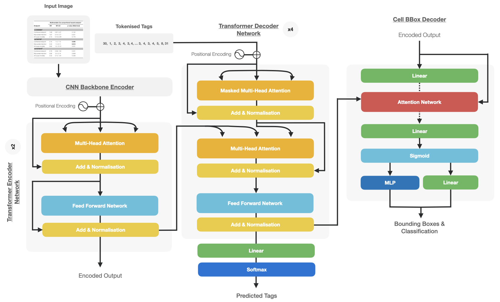

[](https://pypi.org/project/docling-ibm-models/)

[](https://python-poetry.org/)
[](https://github.com/psf/black)
[](https://pycqa.github.io/isort/)
[](https://github.com/pre-commit/pre-commit)
[](https://huggingface.co/ds4sd/docling-models/)
[](https://opensource.org/licenses/MIT)

# Docling IBM models

AI modules to support the Docling PDF document conversion project.

- TableFormer is an AI module that recognizes the structure of a table and the bounding boxes of the table content.
- Layout model is an AI model that provides among other things ability to detect tables on the page. This package contains inference code for Layout model.


## Installation Instructions

### MacOS / Linux

To install `poetry` locally, use either `pip` or `homebrew`.

To install `poetry` on a docker container, do the following:
```
ENV POETRY_NO_INTERACTION=1 \
    POETRY_VIRTUALENVS_CREATE=false

# Install poetry
RUN curl -sSL 'https://install.python-poetry.org' > install-poetry.py \
    && python install-poetry.py \
    && poetry --version \
    && rm install-poetry.py
```

To install and run the package, simply set up a poetry environment

```
poetry env use $(which python3.10)
poetry shell
```

and install all the dependencies,

```
poetry install # this will only install the deps from the poetry.lock

poetry install --no-dev # this will skip installing dev dependencies
```

To update or add new dependencies from `pyproject.toml`, rebuild `poetry.lock`
```
poetry update
```

#### MacOS Intel

When in development mode on MacOS with Intel chips, one can use compatible dependencies with

```console
poetry update --with mac_intel
```


## Pipeline Overview


## Datasets
Below we list datasets used with their description, source, and ***"TableFormer Format"***. The TableFormer Format is our processed version of the version of the original format to work with the dataloader out of the box, and to augment the dataset when necassary to add missing groundtruth (bounding boxes for empty cells).


| Name        | Description      | URL |
| ------------- |:-------------:|----|
| PubTabNet | PubTabNet contains heterogeneous tables in both image and HTML format, 516k+ tables in the PubMed Central Open Access Subset  | [PubTabNet](https://developer.ibm.com/exchanges/data/all/pubtabnet/) |
| FinTabNet| A dataset for Financial Report Tables with corresponding ground truth location and structure. 112k+ tables included.| [FinTabNet](https://developer.ibm.com/exchanges/data/all/fintabnet/) |
| TableBank| TableBank is a new image-based table detection and recognition dataset built with novel weak supervision from Word and Latex documents on the internet, contains 417K high-quality labeled tables. | [TableBank](https://github.com/doc-analysis/TableBank) |

## Models

### TableModel04:

**TableModel04rs (OTSL)** is our SOTA method that using transformers in order to predict table structure and bounding box.


## Configuration file

Example configuration can be found inside test `tests/test_tf_predictor.py`
These are the main sections of the configuration file:

- `dataset`: The directory for prepared data and the parameters used during the data loading.
- `model`: The type, name and hyperparameters of the model. Also the directory to save/load the
  trained checkpoint files.
- `train`: Parameters for the training of the model.
- `predict`: Parameters for the evaluation of the model.
- `dataset_wordmap`: Very important part that contains token maps.


## Model weights

You can download the model weights and config files from the links:

- [TableFormer Checkpoint](https://huggingface.co/ds4sd/docling-models/tree/main/model_artifacts/tableformer)
- [beehive_v0.0.5](https://huggingface.co/ds4sd/docling-models/tree/main/model_artifacts/layout/beehive_v0.0.5)


## Inference Tests

You can run the inference tests for the models with:

```
python -m pytest tests/
```

This will also generate prediction and matching visualizations that can be found here:
`tests\test_data\viz\`

Visualization outlines:
- `Light Pink`: border of recognized table
- `Grey`: OCR cells
- `Green`: prediction bboxes
- `Red`: OCR cells matched with prediction
- `Blue`: Post processed, match
- `Bold Blue`: column header
- `Bold Magenta`: row header
- `Bold Brown`: section row (if table have one)


## Demo

A demo application allows to apply the `LayoutPredictor` on a directory `<input_dir>` that contains
`png` images and visualize the predictions inside another directory `<viz_dir>`.

First download the model weights (see above), then run:
```
python -m demo.demo_layout_predictor -i <input_dir> -v <viz_dir>
```

e.g.
```
python -m demo.demo_layout_predictor -i tests/test_data/samples -v viz/
```
